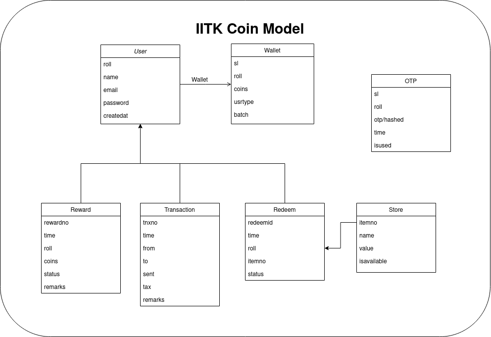

# iitk-coin

## **Summer Project 2021**

## **SnT Project 2021, Programming Club**

This repository contains the backend code for the IITK Coin which is a reward based psuedo currency of IIT Kanpur.

### Relevant Links

- [Midterm Evaluation presentation](https://docs.google.com/presentation/d/1kriN-7A3v1RlXUDL5NETX3roJKRMJInptkWofIxY8dg/edit?usp=sharing)
- [Midterm Documentation](https://docs.google.com/document/d/1bvOWH4k0U-l2pQ1jLWIDzOkJ2wbHNW4jJw7tMWkUV6o/edit?usp=sharing)

## Table Of Content

- [Development Environment](#development-environment)
- [Directory Structure](#directory-structure)
- [Usage](#usage)
- [Endpoints](#endpoints)
- [Models](#models)
- [Settings](#settings)

## Development Environment

```bash
- OS:           Ubuntu 20.04.2 LTS x86-64    # https://ubuntu.com/download
- Kernel:       Linux 5.8.0-59-generic       # https://kernel.ubuntu.com/
- go version:   go1.16.6 linux/amd64         # https://golang.org/dl/
- text editor:  VSCode    	                  # https://code.visualstudio.com/download
- terminal:     Zsh                          # https://ohmyz.sh/
```

## Directory Structure

```
.
~go/src/github.com/1-Harshit/iitk-coin
├── auth
│   └── auth.go
├── config
│   ├── config.go
│   ├── email_cred.go
│   ├── otp.go
│   ├── settings.go
│   └── validate.go
├── data.db
├── db
│   ├── db.go
│   ├── otp.go
│   ├── redeem.go
│   └── user.go
├── Dockerfile
├── go.mod
├── go.sum
├── iitk-coin
├── LICENSE
├── main.go
├── Models.png
├── README.md
└── routes
    ├── redeem.go
    ├── trnxn.go
    ├── user.go
    └── utility.go

4 directories, 23 files
```

## Usage

### Use this Repo

```bash
mkdir $GOPATH/src/github.com/1-Harshit
cd $GOPATH/src/github.com/1-Harshit
git clone https://github.com/1-Harshit/iitk-coin.git
cd iitk-coin

go run main.go
# or build the program and run the executable
go build
./iitk-coin
```

### Use Docker Image

```bash
docker run --rm -p 8080:8080 1harshit/iitk-coin
```

Expected Output:

```
2021/07/18 01:03:46 Starting server. Listening on http://localhost:8080
```

## Endpoints

POST requests take place via `JSON` requests. A typical usage would look like

```bash
curl -H "Content-Type: application/json" [-H "Authorization: Bearer JWT"] --request POST  -d '<json-request>'  http://localhost:8080/<endpoint>
# or if using get
curl [-H "Authorization: Bearer JWT"] --request GET http://localhost:8080/<endpoint>
```

#### Signup

- `/signup/otp` : `POST`

```json
{ "name": "<name>", "roll": "<rollno>", "email": "<emailid>" }
```

- `/signup` : `POST`

```json
{
  "name": "<name>",
  "roll": "<rollno>",
  "email": "<emailid>",
  "password": "<password>",
  "otp": "<otp>",
  "batch": "<batch>"
}
```

#### Login

- `/login` : `POST`

```json
{ "roll": "<rollno>", "password": "<password>" }
```

- `/secretpage` : `GET`

```bash
curl -H "Authorization: Bearer $JWT" --request GET http://localhost:8080/secretpage
```

Auth Header needed in all endpoints below this

#### User's Info

- `/user/info` : `GET`

```bash
curl -H "Authorization: Bearer $JWT" --request GET http://localhost:8080/user/info
```

- `/user/reward` : `GET`

```bash
curl -H "Authorization: Bearer $JWT" --request GET http://localhost:8080/user/reward
```

- `/user/transaction` : `GET`

```bash
curl -H "Authorization: Bearer $JWT" --request GET http://localhost:8080/user/transaction
```

- `/user/redeem` : `GET`

```bash
curl -H "Authorization: Bearer $JWT" --request GET http://localhost:8080/user/redeem
```

#### Reset Password

- `/forgotpass/otp` : `POST`

```json
{ "roll": "<rollno>", "email": "<emailid>" }
```

- `/forgotpass` : `POST`

```json
{ "roll": "<rollno>", "password": "<password>", "otp": "<otp>" }
```

#### Rewards

- `/reward` : `POST` Only GenSec and AH

```json
{ "roll": "<rollno>", "coins": "<coins>" }
```

#### Transfer

- `/transfer/otp` : `GET`

```bash
curl -H "Authorization: Bearer $JWT" --request GET http://localhost:8080/transfer/otp
```

- `/transfer` : `POST`

```json
{ "roll": "<rollno>", "coins": "<coins>", "otp": "<otp>" }
```

#### Store

- `/store/list` : `GET`

```bash
curl --request GET http://localhost:8080/store/list
```

- `/store/add` : `POST` Only GenSec and AH

```json
{ "name": "<itemname>", "value": "<itemvalue>" }
```

- `/store/remove` : `POST` Only GenSec and AH

```json
{ "itemNo": "<itemno>" }
```

#### Redeem

- `/redeem/request/otp` : `GET`

```bash
curl -H "Authorization: Bearer $JWT" --request GET http://localhost:8080/redeem/request/otp
```

- `/redeem/request` : `POST`

```json
{ "itemNo": "<itemno>", "otp": "<otp>" }
```

- `/redeem/list` : `GET` Only GenSec and AH

```bash
curl -H "Authorization: Bearer $JWT" --request GET http://localhost:8080//redeem/list
```

- `/redeem/approve` : `POST` Only GenSec and AH

```json
{ "redeemid": "<redeemid>" }
```

- `/redeem/reject` : `POST` Only GenSec and AH

```json
{ "redeemid": "<redeemid>" }
```

### How to use

1. Run the `main.go` file this will Listen and Serve on `localhost:8080`
2. Use `curl` to use endpoints as shown above

## Models



## Settings

### about `config/settings.go`

Some unkown variables are stored there.

- Path of DB
- Max coins one can have
- Minimum Events needed for transfer
- tax
  - const IntraBatchTax float64 = 0.02
  - const InterBatchTax float64 = 0.33
- const IsStoreOpen bool = true

## Footnotes

I'd like to name it **Koins**
